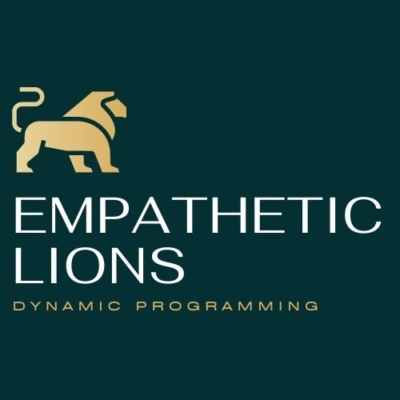

# Frontend Capstone
<div align=center>

</div>

<div align=center>
<a href="https://gitlab.com/m7093/frontend-capstone">
    
  </a>
</div>

<div align=center>

</div>

</br>
<details>
  <summary><b>Table of Contents</b></summary>
  <ol>
    <li>
      <a href="#about-the-project">About The Project</a>
      <ul>
        <li><a href="#built-with">Built With</a></li>
        <li><a href="#visuals">Visuals</a></li>
      </ul>
    </li>
    <li>
      <a href="#getting-started">Getting Started</a>
      <ul>
        <li><a href="#prerequisites">Prerequisites</a></li>
        <li><a href="#installation">Installation</a></li>
        <li><a href="#commands-to-remember">Commands To Remember</a></li>
      </ul>
    </li>
    <li><a href="#usage">Usage</a></li>
    <li><a href="#roadmap">Roadmap</a></li>
    <li><a href="#contributing">Contributing</a></li>
    <li><a href="#license">License</a></li>
    <li><a href="#contact">Contact</a></li>
    <li><a href="#acknowledgements">Acknowledgements</a></li>
  </ol>
</details>
</br>

## About The Project
This application serves as an educational tool for developers and students to visualize how algorithms work. Many people find algorithms a difficult concept to fully understand, especially when current resources are mostly text-based. As a team, we decided to contribute to open source learning with an easy-to-navigate website that allows users the ability to experiment with different algorithms and communicate with other like-minded individuals.
<p align="right">(<a href="#top">back to top</a>)</p>

### Built With
* [React.js](https://reactjs.org/)
* [Node.js]()
* [Express.js]()
* [PostgreSQL]()
<p align="right">(<a href="#top">back to top</a>)</p>


### Visuals

<p align="right">(<a href="#top">back to top</a>)</p>
</br>

## Getting Started
</br>

### Prequisites
Ensure you have the latest version of npm installed
```sh
npm install npm@latest -g
```
<p align="right">(<a href="#top">back to top</a>)</p>

### Installation
1. Clone the repo
   ```sh
   git clone https://gitlab.com/m7093/frontend-capstone 
   ```
2. Install NPM packages
   ```sh
   npm install
   ```
<p align="right">(<a href="#top">back to top</a>)</p>


### Commands To Remember
</br>

#### Database Commands:
```sh
cd /backend

# create migration file
npm run migrate:make [table_name]

# creates/updates tables
npm run migrate

# create seed files
npx knex seed:make [seed_file_name] --knexfile db/knexfile.js

# run seed files
npm run seed

# rollback migration (so you can reset tables in database and reseed)
npm run rollback
```
#### Backend Commands:
```sh
cd /backend

# run backend server
npm run dev
```
#### Frontend Commands:
```sh
cd /frontend
# start React application
npm start
```
<p align="right">(<a href="#top">back to top</a>)</p>


## Usage
* Study Guide
* Algorithm Familiarization
<p align="right">(<a href="#top">back to top</a>)</p>

## Roadmap
- [x] Create all necessary components
- [ ] User authentication
- [ ] Add additional algorithms
- [ ] Mobile-friendly design

<p align="right">(<a href="#top">back to top</a>)</p>

## Contributing
Any contributions you make are **greatly appreciated**.

If you have a suggestion that would make this better, please fork the repo and create a pull request. You can also simply open an issue with the tag "enhancement".
Don't forget to give the project a star! Thanks again!

1. Fork the Project
2. Create your Feature Branch (`git checkout -b feature/AmazingFeature`)
3. Commit your Changes (`git commit -m 'Add some AmazingFeature'`)
4. Push to the Branch (`git push origin feature/AmazingFeature`)
5. Open a Pull Request
<p align="right">(<a href="#top">back to top</a>)</p>

## License
<p align="right">(<a href="#top">back to top</a>)</p>

## Contact
Project Link: [https://gitlab.com/m7093/frontend-capstone](https://gitlab.com/m7093/frontend-capstone)
<p align="right">(<a href="#top">back to top</a>)</p>

## Acknowledgements
</br>

### Empathetic Lions 
#### Core Team
* [Fernando Curiel-Moysen](https://www.linkedin.com/in/fernando-curiel-moysen/)
* [Paul Devlin](https://www.linkedin.com/in/pmdevlin/)
* [Kevin Heleodoro](https://www.linkedin.com/in/kevin-heleodoro/)
* [John "Hank" Moore](https://www.linkedin.com/in/john-ht-moore/)
* [Isaias Nuno](https://www.linkedin.com/in/isaias-nuno-galindo/)
* [Nicholas Rafaelle](https://www.linkedin.com/in/nick-raffaele/)

### Resources
* [Best README template](https://github.com/othneildrew/Best-README-Template/blob/master/README.md)
<p align="right">(<a href="#top">back to top</a>)</p>


<!-- Badge links -->
[for-the-culture]: data:image/svg+xml;base64,PHN2ZyB4bWxucz0iaHR0cDovL3d3dy53My5vcmcvMjAwMC9zdmciIHdpZHRoPSIzMzQuMzI5OTk5OTk5OTk5OSIgaGVpZ2h0PSIzNSIgdmlld0JveD0iMCAwIDMzNC4zMjk5OTk5OTk5OTk5IDM1Ij48cmVjdCBjbGFzcz0ic3ZnX19yZWN0IiB4PSIwIiB5PSIwIiB3aWR0aD0iMTQ0LjIwOTk5OTk5OTk5OTk4IiBoZWlnaHQ9IjM1IiBmaWxsPSIjMDQzMDM0Ii8+PHJlY3QgY2xhc3M9InN2Z19fcmVjdCIgeD0iMTQyLjIwOTk5OTk5OTk5OTk4IiB5PSIwIiB3aWR0aD0iMTkyLjExOTk5OTk5OTk5OTk4IiBoZWlnaHQ9IjM1IiBmaWxsPSIjRDhBRTVFIi8+PHBhdGggY2xhc3M9InN2Z19fdGV4dCIgZD0iTTE2LjI1IDE0LjY2TDEzLjYxIDE0LjY2TDEzLjYxIDEzLjQ3TDIwLjM4IDEzLjQ3TDIwLjM4IDE0LjY2TDE3LjcyIDE0LjY2TDE3LjcyIDIyTDE2LjI1IDIyTDE2LjI1IDE0LjY2Wk0yNS42MiAyMkwyNC4xNCAyMkwyNC4xNCAxMy40N0wyNS42MiAxMy40N0wyNS42MiAxNy4wMkwyOS40MyAxNy4wMkwyOS40MyAxMy40N0wzMC45MSAxMy40N0wzMC45MSAyMkwyOS40MyAyMkwyOS40MyAxOC4yMUwyNS42MiAxOC4yMUwyNS42MiAyMlpNMzcuMjIgMjJMMzUuNzQgMjJMMzUuNzQgMTMuNDdMMzcuMjIgMTMuNDdMMzcuMjIgMjJaTTQxLjU5IDE5LjQyTDQxLjU5IDE5LjQyTDQzLjA3IDE5LjQyUTQzLjA3IDIwLjE1IDQzLjU2IDIwLjU1UTQ0LjA0IDIwLjk1IDQ0LjkzIDIwLjk1TDQ0LjkzIDIwLjk1UTQ1LjcxIDIwLjk1IDQ2LjEwIDIwLjYzUTQ2LjQ4IDIwLjMyIDQ2LjQ4IDE5LjgwTDQ2LjQ4IDE5LjgwUTQ2LjQ4IDE5LjI0IDQ2LjA5IDE4Ljk0UTQ1LjY5IDE4LjYzIDQ0LjY2IDE4LjMyUTQzLjYzIDE4LjAxIDQzLjAyIDE3LjYzTDQzLjAyIDE3LjYzUTQxLjg2IDE2LjkwIDQxLjg2IDE1LjcyTDQxLjg2IDE1LjcyUTQxLjg2IDE0LjY5IDQyLjcwIDE0LjAyUTQzLjU0IDEzLjM1IDQ0Ljg4IDEzLjM1TDQ0Ljg4IDEzLjM1UTQ1Ljc3IDEzLjM1IDQ2LjQ3IDEzLjY4UTQ3LjE2IDE0LjAxIDQ3LjU2IDE0LjYxUTQ3Ljk2IDE1LjIyIDQ3Ljk2IDE1Ljk2TDQ3Ljk2IDE1Ljk2TDQ2LjQ4IDE1Ljk2UTQ2LjQ4IDE1LjI5IDQ2LjA3IDE0LjkxUTQ1LjY1IDE0LjU0IDQ0Ljg3IDE0LjU0TDQ0Ljg3IDE0LjU0UTQ0LjE0IDE0LjU0IDQzLjc0IDE0Ljg1UTQzLjM0IDE1LjE2IDQzLjM0IDE1LjcxTDQzLjM0IDE1LjcxUTQzLjM0IDE2LjE4IDQzLjc3IDE2LjUwUTQ0LjIxIDE2LjgxIDQ1LjIwIDE3LjEwUTQ2LjIwIDE3LjQwIDQ2LjgwIDE3Ljc4UTQ3LjQwIDE4LjE2IDQ3LjY5IDE4LjY1UTQ3Ljk3IDE5LjEzIDQ3Ljk3IDE5Ljc5TDQ3Ljk3IDE5Ljc5UTQ3Ljk3IDIwLjg2IDQ3LjE1IDIxLjQ5UTQ2LjMzIDIyLjEyIDQ0LjkzIDIyLjEyTDQ0LjkzIDIyLjEyUTQ0LjAxIDIyLjEyIDQzLjIzIDIxLjc3UTQyLjQ1IDIxLjQzIDQyLjAyIDIwLjgzUTQxLjU5IDIwLjIyIDQxLjU5IDE5LjQyWk02MS4zNCAyMkw1OC4yMyAyMkw1OC4yMyAxMy40N0w2MS4xNiAxMy40N1E2Mi42MCAxMy40NyA2My4zNiAxNC4wNVE2NC4xMiAxNC42MyA2NC4xMiAxNS43OEw2NC4xMiAxNS43OFE2NC4xMiAxNi4zNiA2My44MCAxNi44M1E2My40OCAxNy4zMCA2Mi44NyAxNy41Nkw2Mi44NyAxNy41NlE2My41NiAxNy43NSA2My45NCAxOC4yNlE2NC4zMiAxOC43OCA2NC4zMiAxOS41MUw2NC4zMiAxOS41MVE2NC4zMiAyMC43MSA2My41NSAyMS4zNlE2Mi43OCAyMiA2MS4zNCAyMkw2MS4zNCAyMlpNNTkuNzIgMTguMTVMNTkuNzIgMjAuODJMNjEuMzYgMjAuODJRNjIuMDYgMjAuODIgNjIuNDUgMjAuNDdRNjIuODQgMjAuMTMgNjIuODQgMTkuNTFMNjIuODQgMTkuNTFRNjIuODQgMTguMTggNjEuNDggMTguMTVMNjEuNDggMTguMTVMNTkuNzIgMTguMTVaTTU5LjcyIDE0LjY2TDU5LjcyIDE3LjA2TDYxLjE3IDE3LjA2UTYxLjg2IDE3LjA2IDYyLjI1IDE2Ljc1UTYyLjY0IDE2LjQzIDYyLjY0IDE1Ljg2TDYyLjY0IDE1Ljg2UTYyLjY0IDE1LjIzIDYyLjI4IDE0Ljk1UTYxLjkyIDE0LjY2IDYxLjE2IDE0LjY2TDYxLjE2IDE0LjY2TDU5LjcyIDE0LjY2Wk02OS41NyAyMkw2OC4wMyAyMkw3MS4yNSAxMy40N0w3Mi41OCAxMy40N0w3NS44MSAyMkw3NC4yNiAyMkw3My41NyAyMC4wMUw3MC4yNiAyMC4wMUw2OS41NyAyMlpNNzEuOTEgMTUuMjhMNzAuNjggMTguODJMNzMuMTUgMTguODJMNzEuOTEgMTUuMjhaTTgyLjIyIDIyTDc5Ljc3IDIyTDc5Ljc3IDEzLjQ3TDgyLjI5IDEzLjQ3UTgzLjQyIDEzLjQ3IDg0LjI5IDEzLjk3UTg1LjE3IDE0LjQ4IDg1LjY1IDE1LjQwUTg2LjEzIDE2LjMzIDg2LjEzIDE3LjUyTDg2LjEzIDE3LjUyTDg2LjEzIDE3Ljk1UTg2LjEzIDE5LjE2IDg1LjY1IDIwLjA4UTg1LjE2IDIxLjAwIDg0LjI3IDIxLjUwUTgzLjM4IDIyIDgyLjIyIDIyTDgyLjIyIDIyWk04MS4yNSAxNC42Nkw4MS4yNSAyMC44Mkw4Mi4yMiAyMC44MlE4My4zOCAyMC44MiA4NC4wMSAyMC4wOVE4NC42MyAxOS4zNiA4NC42NCAxNy45OUw4NC42NCAxNy45OUw4NC42NCAxNy41MlE4NC42NCAxNi4xMyA4NC4wNCAxNS40MFE4My40MyAxNC42NiA4Mi4yOSAxNC42Nkw4Mi4yOSAxNC42Nkw4MS4yNSAxNC42NlpNOTAuMzUgMTguMTNMOTAuMzUgMTguMTNMOTAuMzUgMTcuNDZROTAuMzUgMTUuNTMgOTEuMjcgMTQuNDRROTIuMjAgMTMuMzUgOTMuODYgMTMuMzVMOTMuODYgMTMuMzVROTUuMjggMTMuMzUgOTYuMTIgMTQuMDVROTYuOTYgMTQuNzYgOTcuMTMgMTYuMDhMOTcuMTMgMTYuMDhMOTUuNjcgMTYuMDhROTUuNDMgMTQuNTQgOTMuODkgMTQuNTRMOTMuODkgMTQuNTRROTIuODkgMTQuNTQgOTIuMzcgMTUuMjZROTEuODUgMTUuOTggOTEuODQgMTcuMzdMOTEuODQgMTcuMzdMOTEuODQgMTguMDJROTEuODQgMTkuNDAgOTIuNDIgMjAuMTdROTMuMDAgMjAuOTMgOTQuMDQgMjAuOTNMOTQuMDQgMjAuOTNROTUuMTggMjAuOTMgOTUuNjYgMjAuNDJMOTUuNjYgMjAuNDJMOTUuNjYgMTguNzVMOTMuOTAgMTguNzVMOTMuOTAgMTcuNjJMOTcuMTMgMTcuNjJMOTcuMTMgMjAuODlROTYuNjcgMjEuNTAgOTUuODUgMjEuODFROTUuMDMgMjIuMTIgOTMuOTkgMjIuMTJMOTMuOTkgMjIuMTJROTIuOTEgMjIuMTIgOTIuMDkgMjEuNjNROTEuMjYgMjEuMTQgOTAuODEgMjAuMjRROTAuMzcgMTkuMzMgOTAuMzUgMTguMTNaTTEwNy4zMyAyMkwxMDEuNzUgMjJMMTAxLjc1IDEzLjQ3TDEwNy4yOSAxMy40N0wxMDcuMjkgMTQuNjZMMTAzLjIzIDE0LjY2TDEwMy4yMyAxNy4wMkwxMDYuNzQgMTcuMDJMMTA2Ljc0IDE4LjE5TDEwMy4yMyAxOC4xOUwxMDMuMjMgMjAuODJMMTA3LjMzIDIwLjgyTDEwNy4zMyAyMlpNMTE5LjA2IDIyTDExNy41OSAyMkwxMTcuNTkgMTMuNDdMMTE5LjA2IDEzLjQ3TDExOS4wNiAyMlpNMTIzLjQ0IDE5LjQyTDEyMy40NCAxOS40MkwxMjQuOTIgMTkuNDJRMTI0LjkyIDIwLjE1IDEyNS40MCAyMC41NVExMjUuODkgMjAuOTUgMTI2Ljc4IDIwLjk1TDEyNi43OCAyMC45NVExMjcuNTYgMjAuOTUgMTI3Ljk0IDIwLjYzUTEyOC4zMyAyMC4zMiAxMjguMzMgMTkuODBMMTI4LjMzIDE5LjgwUTEyOC4zMyAxOS4yNCAxMjcuOTQgMTguOTRRMTI3LjU0IDE4LjYzIDEyNi41MSAxOC4zMlExMjUuNDggMTguMDEgMTI0Ljg3IDE3LjYzTDEyNC44NyAxNy42M1ExMjMuNzEgMTYuOTAgMTIzLjcxIDE1LjcyTDEyMy43MSAxNS43MlExMjMuNzEgMTQuNjkgMTI0LjU1IDE0LjAyUTEyNS4zOSAxMy4zNSAxMjYuNzMgMTMuMzVMMTI2LjczIDEzLjM1UTEyNy42MiAxMy4zNSAxMjguMzIgMTMuNjhRMTI5LjAxIDE0LjAxIDEyOS40MSAxNC42MVExMjkuODEgMTUuMjIgMTI5LjgxIDE1Ljk2TDEyOS44MSAxNS45NkwxMjguMzMgMTUuOTZRMTI4LjMzIDE1LjI5IDEyNy45MiAxNC45MVExMjcuNTAgMTQuNTQgMTI2LjcyIDE0LjU0TDEyNi43MiAxNC41NFExMjUuOTkgMTQuNTQgMTI1LjU5IDE0Ljg1UTEyNS4xOSAxNS4xNiAxMjUuMTkgMTUuNzFMMTI1LjE5IDE1LjcxUTEyNS4xOSAxNi4xOCAxMjUuNjIgMTYuNTBRMTI2LjA2IDE2LjgxIDEyNy4wNSAxNy4xMFExMjguMDUgMTcuNDAgMTI4LjY1IDE3Ljc4UTEyOS4yNSAxOC4xNiAxMjkuNTQgMTguNjVRMTI5LjgyIDE5LjEzIDEyOS44MiAxOS43OUwxMjkuODIgMTkuNzlRMTI5LjgyIDIwLjg2IDEyOS4wMCAyMS40OVExMjguMTggMjIuMTIgMTI2Ljc4IDIyLjEyTDEyNi43OCAyMi4xMlExMjUuODYgMjIuMTIgMTI1LjA4IDIxLjc3UTEyNC4zMCAyMS40MyAxMjMuODcgMjAuODNRMTIzLjQ0IDIwLjIyIDEyMy40NCAxOS40MloiIGZpbGw9IiNFN0Q0OUUiLz48cGF0aCBjbGFzcz0ic3ZnX190ZXh0IiBkPSJNMTU4Ljc4IDIyTDE1Ni40MCAyMkwxNTYuNDAgMTMuNjBMMTYyLjk5IDEzLjYwTDE2Mi45OSAxNS40NEwxNTguNzggMTUuNDRMMTU4Ljc4IDE3LjI4TDE2Mi40OSAxNy4yOEwxNjIuNDkgMTkuMTJMMTU4Ljc4IDE5LjEyTDE1OC43OCAyMlpNMTY3LjE2IDE3LjgwTDE2Ny4xNiAxNy44MFExNjcuMTYgMTYuNTUgMTY3Ljc2IDE1LjU1UTE2OC4zNiAxNC41NiAxNjkuNDMgMTQuMDBRMTcwLjQ5IDEzLjQzIDE3MS44MiAxMy40M0wxNzEuODIgMTMuNDNRMTczLjE1IDEzLjQzIDE3NC4yMSAxNC4wMFExNzUuMjggMTQuNTYgMTc1Ljg4IDE1LjU1UTE3Ni40OSAxNi41NSAxNzYuNDkgMTcuODBMMTc2LjQ5IDE3LjgwUTE3Ni40OSAxOS4wNSAxNzUuODggMjAuMDRRMTc1LjI4IDIxLjA0IDE3NC4yMiAyMS42MFExNzMuMTYgMjIuMTcgMTcxLjgyIDIyLjE3TDE3MS44MiAyMi4xN1ExNzAuNDkgMjIuMTcgMTY5LjQzIDIxLjYwUTE2OC4zNiAyMS4wNCAxNjcuNzYgMjAuMDRRMTY3LjE2IDE5LjA1IDE2Ny4xNiAxNy44MFpNMTY5LjU1IDE3LjgwTDE2OS41NSAxNy44MFExNjkuNTUgMTguNTEgMTY5Ljg1IDE5LjA1UTE3MC4xNiAxOS42MCAxNzAuNjcgMTkuOTBRMTcxLjE5IDIwLjIwIDE3MS44MiAyMC4yMEwxNzEuODIgMjAuMjBRMTcyLjQ2IDIwLjIwIDE3Mi45NyAxOS45MFExNzMuNDkgMTkuNjAgMTczLjc5IDE5LjA1UTE3NC4wOSAxOC41MSAxNzQuMDkgMTcuODBMMTc0LjA5IDE3LjgwUTE3NC4wOSAxNy4wOSAxNzMuNzkgMTYuNTRRMTczLjQ5IDE2IDE3Mi45NyAxNS43MFExNzIuNDYgMTUuNDAgMTcxLjgyIDE1LjQwTDE3MS44MiAxNS40MFExNzEuMTggMTUuNDAgMTcwLjY3IDE1LjcwUTE3MC4xNiAxNiAxNjkuODUgMTYuNTRRMTY5LjU1IDE3LjA5IDE2OS41NSAxNy44MFpNMTgzLjYwIDIyTDE4MS4yMiAyMkwxODEuMjIgMTMuNjBMMTg1LjA2IDEzLjYwUTE4Ni4yMCAxMy42MCAxODcuMDQgMTMuOThRMTg3Ljg4IDE0LjM1IDE4OC4zNCAxNS4wNlExODguNzkgMTUuNzYgMTg4Ljc5IDE2LjcxTDE4OC43OSAxNi43MVExODguNzkgMTcuNjIgMTg4LjM3IDE4LjMwUTE4Ny45NCAxOC45OCAxODcuMTUgMTkuMzZMMTg3LjE1IDE5LjM2TDE4OC45NiAyMkwxODYuNDIgMjJMMTg0Ljg5IDE5Ljc3TDE4My42MCAxOS43N0wxODMuNjAgMjJaTTE4My42MCAxNS40N0wxODMuNjAgMTcuOTNMMTg0LjkyIDE3LjkzUTE4NS42NSAxNy45MyAxODYuMDIgMTcuNjFRMTg2LjM5IDE3LjI5IDE4Ni4zOSAxNi43MUwxODYuMzkgMTYuNzFRMTg2LjM5IDE2LjEyIDE4Ni4wMiAxNS43OVExODUuNjUgMTUuNDcgMTg0LjkyIDE1LjQ3TDE4NC45MiAxNS40N0wxODMuNjAgMTUuNDdaTTIwMi4zNSAxNS40OEwxOTkuNzYgMTUuNDhMMTk5Ljc2IDEzLjYwTDIwNy4yOSAxMy42MEwyMDcuMjkgMTUuNDhMMjA0LjcyIDE1LjQ4TDIwNC43MiAyMkwyMDIuMzUgMjJMMjAyLjM1IDE1LjQ4Wk0yMTQuMDQgMjJMMjExLjY2IDIyTDIxMS42NiAxMy42MEwyMTQuMDQgMTMuNjBMMjE0LjA0IDE2Ljc2TDIxNy4yOCAxNi43NkwyMTcuMjggMTMuNjBMMjE5LjY1IDEzLjYwTDIxOS42NSAyMkwyMTcuMjggMjJMMjE3LjI4IDE4LjcyTDIxNC4wNCAxOC43MkwyMTQuMDQgMjJaTTIzMS41NiAyMkwyMjQuODEgMjJMMjI0LjgxIDEzLjYwTDIzMS40MCAxMy42MEwyMzEuNDAgMTUuNDRMMjI3LjE3IDE1LjQ0TDIyNy4xNyAxNi44NUwyMzAuOTAgMTYuODVMMjMwLjkwIDE4LjYzTDIyNy4xNyAxOC42M0wyMjcuMTcgMjAuMTdMMjMxLjU2IDIwLjE3TDIzMS41NiAyMlpNMjQyLjkxIDE3LjgwTDI0Mi45MSAxNy44MFEyNDIuOTEgMTYuNTQgMjQzLjUwIDE1LjU0UTI0NC4xMCAxNC41NSAyNDUuMTUgMTMuOTlRMjQ2LjIwIDEzLjQzIDI0Ny41MiAxMy40M0wyNDcuNTIgMTMuNDNRMjQ4LjY4IDEzLjQzIDI0OS42MCAxMy44NFEyNTAuNTIgMTQuMjUgMjUxLjE0IDE1LjAyTDI1MS4xNCAxNS4wMkwyNDkuNjMgMTYuMzlRMjQ4LjgxIDE1LjQwIDI0Ny42NSAxNS40MEwyNDcuNjUgMTUuNDBRMjQ2Ljk2IDE1LjQwIDI0Ni40MyAxNS43MFEyNDUuODkgMTYgMjQ1LjYwIDE2LjU0UTI0NS4zMCAxNy4wOSAyNDUuMzAgMTcuODBMMjQ1LjMwIDE3LjgwUTI0NS4zMCAxOC41MSAyNDUuNjAgMTkuMDVRMjQ1Ljg5IDE5LjYwIDI0Ni40MyAxOS45MFEyNDYuOTYgMjAuMjAgMjQ3LjY1IDIwLjIwTDI0Ny42NSAyMC4yMFEyNDguODEgMjAuMjAgMjQ5LjYzIDE5LjIyTDI0OS42MyAxOS4yMkwyNTEuMTQgMjAuNThRMjUwLjUzIDIxLjM1IDI0OS42MCAyMS43NlEyNDguNjggMjIuMTcgMjQ3LjUyIDIyLjE3TDI0Ny41MiAyMi4xN1EyNDYuMjAgMjIuMTcgMjQ1LjE1IDIxLjYxUTI0NC4xMCAyMS4wNSAyNDMuNTAgMjAuMDVRMjQyLjkxIDE5LjA2IDI0Mi45MSAxNy44MFpNMjU1LjYwIDE4LjI2TDI1NS42MCAxOC4yNkwyNTUuNjAgMTMuNjBMMjU3Ljk4IDEzLjYwTDI1Ny45OCAxOC4xOVEyNTcuOTggMjAuMjAgMjU5LjU4IDIwLjIwTDI1OS41OCAyMC4yMFEyNjEuMTYgMjAuMjAgMjYxLjE2IDE4LjE5TDI2MS4xNiAxOC4xOUwyNjEuMTYgMTMuNjBMMjYzLjUwIDEzLjYwTDI2My41MCAxOC4yNlEyNjMuNTAgMjAuMTMgMjYyLjQ2IDIxLjE1UTI2MS40MiAyMi4xNyAyNTkuNTUgMjIuMTdMMjU5LjU1IDIyLjE3UTI1Ny42OCAyMi4xNyAyNTYuNjQgMjEuMTVRMjU1LjYwIDIwLjEzIDI1NS42MCAxOC4yNlpNMjc0Ljk3IDIyTDI2OC41OSAyMkwyNjguNTkgMTMuNjBMMjcwLjk3IDEzLjYwTDI3MC45NyAyMC4xMUwyNzQuOTcgMjAuMTFMMjc0Ljk3IDIyWk0yODEuMTkgMTUuNDhMMjc4LjYwIDE1LjQ4TDI3OC42MCAxMy42MEwyODYuMTIgMTMuNjBMMjg2LjEyIDE1LjQ4TDI4My41NiAxNS40OEwyODMuNTYgMjJMMjgxLjE5IDIyTDI4MS4xOSAxNS40OFpNMjkwLjQzIDE4LjI2TDI5MC40MyAxOC4yNkwyOTAuNDMgMTMuNjBMMjkyLjgwIDEzLjYwTDI5Mi44MCAxOC4xOVEyOTIuODAgMjAuMjAgMjk0LjQwIDIwLjIwTDI5NC40MCAyMC4yMFEyOTUuOTggMjAuMjAgMjk1Ljk4IDE4LjE5TDI5NS45OCAxOC4xOUwyOTUuOTggMTMuNjBMMjk4LjMyIDEzLjYwTDI5OC4zMiAxOC4yNlEyOTguMzIgMjAuMTMgMjk3LjI4IDIxLjE1UTI5Ni4yNCAyMi4xNyAyOTQuMzcgMjIuMTdMMjk0LjM3IDIyLjE3UTI5Mi41MCAyMi4xNyAyOTEuNDYgMjEuMTVRMjkwLjQzIDIwLjEzIDI5MC40MyAxOC4yNlpNMzA1Ljc5IDIyTDMwMy40MSAyMkwzMDMuNDEgMTMuNjBMMzA3LjI1IDEzLjYwUTMwOC40MCAxMy42MCAzMDkuMjMgMTMuOThRMzEwLjA3IDE0LjM1IDMxMC41MyAxNS4wNlEzMTAuOTkgMTUuNzYgMzEwLjk5IDE2LjcxTDMxMC45OSAxNi43MVEzMTAuOTkgMTcuNjIgMzEwLjU2IDE4LjMwUTMxMC4xMyAxOC45OCAzMDkuMzQgMTkuMzZMMzA5LjM0IDE5LjM2TDMxMS4xNSAyMkwzMDguNjEgMjJMMzA3LjA4IDE5Ljc3TDMwNS43OSAxOS43N0wzMDUuNzkgMjJaTTMwNS43OSAxNS40N0wzMDUuNzkgMTcuOTNMMzA3LjExIDE3LjkzUTMwNy44NCAxNy45MyAzMDguMjEgMTcuNjFRMzA4LjU4IDE3LjI5IDMwOC41OCAxNi43MUwzMDguNTggMTYuNzFRMzA4LjU4IDE2LjEyIDMwOC4yMSAxNS43OVEzMDcuODQgMTUuNDcgMzA3LjExIDE1LjQ3TDMwNy4xMSAxNS40N0wzMDUuNzkgMTUuNDdaTTMyMi41MiAyMkwzMTUuNzcgMjJMMzE1Ljc3IDEzLjYwTDMyMi4zNiAxMy42MEwzMjIuMzYgMTUuNDRMMzE4LjEzIDE1LjQ0TDMxOC4xMyAxNi44NUwzMjEuODYgMTYuODVMMzIxLjg2IDE4LjYzTDMxOC4xMyAxOC42M0wzMTguMTMgMjAuMTdMMzIyLjUyIDIwLjE3TDMyMi41MiAyMloiIGZpbGw9IiNGRkZGRkYiIHg9IjE1NS4yMDk5OTk5OTk5OTk5OCIvPjwvc3ZnPg==

[optimized]: data:image/svg+xml;base64,PHN2ZyB4bWxucz0iaHR0cDovL3d3dy53My5vcmcvMjAwMC9zdmciIHdpZHRoPSIxNjguODciIGhlaWdodD0iMzUiIHZpZXdCb3g9IjAgMCAxNjguODcgMzUiPjxyZWN0IGNsYXNzPSJzdmdfX3JlY3QiIHg9IjAiIHk9IjAiIHdpZHRoPSI0NS40OSIgaGVpZ2h0PSIzNSIgZmlsbD0iIzA0MzAzNCIvPjxyZWN0IGNsYXNzPSJzdmdfX3JlY3QiIHg9IjQzLjQ5IiB5PSIwIiB3aWR0aD0iMTI1LjM4IiBoZWlnaHQ9IjM1IiBmaWxsPSIjRDhBRTVFIi8+PHBhdGggY2xhc3M9InN2Z19fdGV4dCIgZD0iTTEzLjk3IDE4LjUxTDEzLjk3IDE4LjUxTDEzLjk3IDE3LjAzUTEzLjk3IDE1LjE5IDE0LjY1IDE0LjI3UTE1LjM0IDEzLjM1IDE2Ljc1IDEzLjM1TDE2Ljc1IDEzLjM1UTE4LjE1IDEzLjM1IDE4Ljg0IDE0LjI1UTE5LjUzIDE1LjE0IDE5LjU1IDE2LjkzTDE5LjU1IDE2LjkzTDE5LjU1IDE4LjQxUTE5LjU1IDIwLjI1IDE4Ljg2IDIxLjE4UTE4LjE3IDIyLjEyIDE2Ljc3IDIyLjEyTDE2Ljc3IDIyLjEyUTE1LjM4IDIyLjEyIDE0LjY4IDIxLjIxUTEzLjk4IDIwLjI5IDEzLjk3IDE4LjUxWk0xNS4zOCAxNi42OEwxNS4zOCAxOC42MVExNS4zOCAxOS44MSAxNS43MiAyMC4zOVExNi4wNSAyMC45OCAxNi43NyAyMC45OEwxNi43NyAyMC45OFExNy40NSAyMC45OCAxNy43OCAyMC40NFExOC4xMSAxOS45MCAxOC4xMyAxOC43NEwxOC4xMyAxOC43NEwxOC4xMyAxNi44MVExOC4xMyAxNS42MSAxNy44MCAxNS4wNVExNy40NyAxNC40OSAxNi43NSAxNC40OUwxNi43NSAxNC40OVExNi4wNiAxNC40OSAxNS43MyAxNS4wMlExNS40MCAxNS41NSAxNS4zOCAxNi42OEwxNS4zOCAxNi42OFpNMjMuNzQgMTUuNTNMMjMuNzQgMTUuNTNMMjMuNzQgMTUuMTFRMjMuNzQgMTQuMzQgMjQuMjQgMTMuODRRMjQuNzMgMTMuMzUgMjUuNTQgMTMuMzVMMjUuNTQgMTMuMzVRMjYuMzYgMTMuMzUgMjYuODYgMTMuODRRMjcuMzUgMTQuMzQgMjcuMzUgMTUuMTRMMjcuMzUgMTUuMTRMMjcuMzUgMTUuNTZRMjcuMzUgMTYuMzMgMjYuODYgMTYuODJRMjYuMzYgMTcuMzEgMjUuNTYgMTcuMzFMMjUuNTYgMTcuMzFRMjQuNzYgMTcuMzEgMjQuMjUgMTYuODNRMjMuNzQgMTYuMzUgMjMuNzQgMTUuNTNaTTI0LjczIDE1LjEzTDI0LjczIDE1LjU2UTI0LjczIDE1Ljk2IDI0Ljk2IDE2LjIxUTI1LjE5IDE2LjQ2IDI1LjU2IDE2LjQ2TDI1LjU2IDE2LjQ2UTI1LjkyIDE2LjQ2IDI2LjE0IDE2LjIxUTI2LjM2IDE1Ljk2IDI2LjM2IDE1LjU0TDI2LjM2IDE1LjU0TDI2LjM2IDE1LjExUTI2LjM2IDE0LjcxIDI2LjE0IDE0LjQ1UTI1LjkxIDE0LjIwIDI1LjU0IDE0LjIwUTI1LjE3IDE0LjIwIDI0Ljk1IDE0LjQ2UTI0LjczIDE0LjcxIDI0LjczIDE1LjEzTDI0LjczIDE1LjEzWk0yNS44NSAyMS4zNkwyNS4xMiAyMC45NEwyOS4yOCAxNC4yN0wzMC4wMSAxNC42OUwyNS44NSAyMS4zNlpNMjcuODQgMjAuMzRMMjcuODQgMjAuMzRMMjcuODQgMTkuOTFRMjcuODQgMTkuMTIgMjguMzUgMTguNjRRMjguODYgMTguMTUgMjkuNjUgMTguMTVMMjkuNjUgMTguMTVRMzAuNDUgMTguMTUgMzAuOTUgMTguNjRRMzEuNDYgMTkuMTIgMzEuNDYgMTkuOTVMMzEuNDYgMTkuOTVMMzEuNDYgMjAuMzdRMzEuNDYgMjEuMTMgMzAuOTcgMjEuNjJRMzAuNDggMjIuMTIgMjkuNjYgMjIuMTJRMjguODQgMjIuMTIgMjguMzQgMjEuNjNRMjcuODQgMjEuMTQgMjcuODQgMjAuMzRaTTI4Ljg0IDE5LjkzTDI4Ljg0IDIwLjM3UTI4Ljg0IDIwLjc2IDI5LjA3IDIxLjAyUTI5LjMwIDIxLjI3IDI5LjY2IDIxLjI3TDI5LjY2IDIxLjI3UTMwLjA0IDIxLjI3IDMwLjI1IDIxLjAzUTMwLjQ3IDIwLjc5IDMwLjQ3IDIwLjM1TDMwLjQ3IDIwLjM1TDMwLjQ3IDE5LjkxUTMwLjQ3IDE5LjUwIDMwLjI0IDE5LjI1UTMwLjAxIDE5LjAxIDI5LjY1IDE5LjAxTDI5LjY1IDE5LjAxUTI5LjI5IDE5LjAxIDI5LjA2IDE5LjI1UTI4Ljg0IDE5LjUwIDI4Ljg0IDE5LjkzTDI4Ljg0IDE5LjkzWiIgZmlsbD0iI0U3RDQ5RSIvPjxwYXRoIGNsYXNzPSJzdmdfX3RleHQiIGQ9Ik01Ny4yNSAxNy44MEw1Ny4yNSAxNy44MFE1Ny4yNSAxNi41NSA1Ny44NSAxNS41NVE1OC40NiAxNC41NiA1OS41MiAxNC4wMFE2MC41OCAxMy40MyA2MS45MSAxMy40M0w2MS45MSAxMy40M1E2My4yNCAxMy40MyA2NC4zMSAxNC4wMFE2NS4zNyAxNC41NiA2NS45OCAxNS41NVE2Ni41OCAxNi41NSA2Ni41OCAxNy44MEw2Ni41OCAxNy44MFE2Ni41OCAxOS4wNSA2NS45OCAyMC4wNFE2NS4zNyAyMS4wNCA2NC4zMSAyMS42MFE2My4yNSAyMi4xNyA2MS45MSAyMi4xN0w2MS45MSAyMi4xN1E2MC41OCAyMi4xNyA1OS41MiAyMS42MFE1OC40NiAyMS4wNCA1Ny44NSAyMC4wNFE1Ny4yNSAxOS4wNSA1Ny4yNSAxNy44MFpNNTkuNjUgMTcuODBMNTkuNjUgMTcuODBRNTkuNjUgMTguNTEgNTkuOTUgMTkuMDVRNjAuMjUgMTkuNjAgNjAuNzcgMTkuOTBRNjEuMjggMjAuMjAgNjEuOTEgMjAuMjBMNjEuOTEgMjAuMjBRNjIuNTUgMjAuMjAgNjMuMDcgMTkuOTBRNjMuNTggMTkuNjAgNjMuODggMTkuMDVRNjQuMTggMTguNTEgNjQuMTggMTcuODBMNjQuMTggMTcuODBRNjQuMTggMTcuMDkgNjMuODggMTYuNTRRNjMuNTggMTYgNjMuMDcgMTUuNzBRNjIuNTUgMTUuNDAgNjEuOTEgMTUuNDBMNjEuOTEgMTUuNDBRNjEuMjggMTUuNDAgNjAuNzYgMTUuNzBRNjAuMjUgMTYgNTkuOTUgMTYuNTRRNTkuNjUgMTcuMDkgNTkuNjUgMTcuODBaTTczLjY5IDIyTDcxLjMxIDIyTDcxLjMxIDEzLjYwTDc1LjE2IDEzLjYwUTc2LjI5IDEzLjYwIDc3LjEzIDEzLjk4UTc3Ljk3IDE0LjM1IDc4LjQzIDE1LjA2UTc4Ljg5IDE1Ljc2IDc4Ljg5IDE2LjcxTDc4Ljg5IDE2LjcxUTc4Ljg5IDE3LjY2IDc4LjQzIDE4LjM1UTc3Ljk3IDE5LjA1IDc3LjEzIDE5LjQyUTc2LjI5IDE5LjgwIDc1LjE2IDE5LjgwTDc1LjE2IDE5LjgwTDczLjY5IDE5LjgwTDczLjY5IDIyWk03My42OSAxNS40N0w3My42OSAxNy45M0w3NS4wMSAxNy45M1E3NS43NCAxNy45MyA3Ni4xMSAxNy42MVE3Ni40OSAxNy4yOSA3Ni40OSAxNi43MUw3Ni40OSAxNi43MVE3Ni40OSAxNi4xMiA3Ni4xMSAxNS44MFE3NS43NCAxNS40NyA3NS4wMSAxNS40N0w3NS4wMSAxNS40N0w3My42OSAxNS40N1pNODUuNDMgMTUuNDhMODIuODUgMTUuNDhMODIuODUgMTMuNjBMOTAuMzcgMTMuNjBMOTAuMzcgMTUuNDhMODcuODEgMTUuNDhMODcuODEgMjJMODUuNDMgMjJMODUuNDMgMTUuNDhaTTk3LjEyIDIyTDk0Ljc0IDIyTDk0Ljc0IDEzLjYwTDk3LjEyIDEzLjYwTDk3LjEyIDIyWk0xMDQuNDkgMjJMMTAyLjMwIDIyTDEwMi4zMCAxMy42MEwxMDQuMjUgMTMuNjBMMTA3LjIxIDE4LjQ1TDExMC4wOSAxMy42MEwxMTIuMDQgMTMuNjBMMTEyLjA2IDIyTDEwOS44OCAyMkwxMDkuODYgMTcuNTVMMTA3LjcwIDIxLjE3TDEwNi42NCAyMS4xN0wxMDQuNDkgMTcuNjdMMTA0LjQ5IDIyWk0xMTkuNjEgMjJMMTE3LjIzIDIyTDExNy4yMyAxMy42MEwxMTkuNjEgMTMuNjBMMTE5LjYxIDIyWk0xMzEuODkgMjJMMTI0LjM2IDIyTDEyNC4zNiAyMC41MUwxMjguNjAgMTUuNDhMMTI0LjQ3IDE1LjQ4TDEyNC40NyAxMy42MEwxMzEuNzEgMTMuNjBMMTMxLjcxIDE1LjA5TDEyNy40NyAyMC4xMUwxMzEuODkgMjAuMTFMMTMxLjg5IDIyWk0xNDMuMTUgMjJMMTM2LjQxIDIyTDEzNi40MSAxMy42MEwxNDMuMDAgMTMuNjBMMTQzLjAwIDE1LjQ0TDEzOC43NyAxNS40NEwxMzguNzcgMTYuODVMMTQyLjUwIDE2Ljg1TDE0Mi41MCAxOC42M0wxMzguNzcgMTguNjNMMTM4Ljc3IDIwLjE3TDE0My4xNSAyMC4xN0wxNDMuMTUgMjJaTTE1MS45MyAyMkwxNDcuOTYgMjJMMTQ3Ljk2IDEzLjYwTDE1MS45MyAxMy42MFExNTMuMzEgMTMuNjAgMTU0LjM4IDE0LjEyUTE1NS40NSAxNC42MyAxNTYuMDQgMTUuNThRMTU2LjYzIDE2LjUzIDE1Ni42MyAxNy44MEwxNTYuNjMgMTcuODBRMTU2LjYzIDE5LjA3IDE1Ni4wNCAyMC4wMlExNTUuNDUgMjAuOTcgMTU0LjM4IDIxLjQ4UTE1My4zMSAyMiAxNTEuOTMgMjJMMTUxLjkzIDIyWk0xNTAuMzQgMTUuNTBMMTUwLjM0IDIwLjEwTDE1MS44NCAyMC4xMFExNTIuOTIgMjAuMTAgMTUzLjU3IDE5LjQ5UTE1NC4yMiAxOC44OCAxNTQuMjIgMTcuODBMMTU0LjIyIDE3LjgwUTE1NC4yMiAxNi43MiAxNTMuNTcgMTYuMTFRMTUyLjkyIDE1LjUwIDE1MS44NCAxNS41MEwxNTEuODQgMTUuNTBMMTUwLjM0IDE1LjUwWiIgZmlsbD0iI0ZGRkZGRiIgeD0iNTYuNDkiLz48L3N2Zz4=